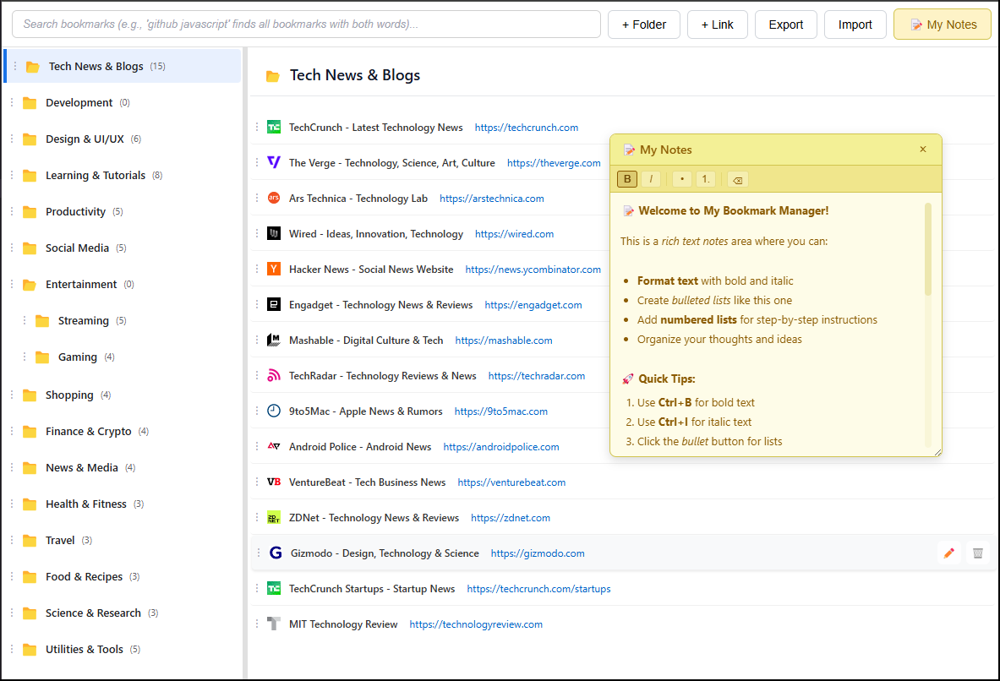

# Bookmark Manager

A modern, feature-rich bookmark management application with rich text notes, drag-and-drop organization, and a clean, intuitive interface.


## Interface Preview



*Clean, modern interface with rich text notes, folder organization, and intuitive controls*

## Why Choose a Bookmark Manager?

### **Lightweight and Fast**
Unlike traditional browser tab management systems, which can slow down performance, this bookmark manager is designed to be lightweight, ensuring that your browser runs smoothly.

### **Customizable Storage**
By saving bookmarks in a JSON file, you have the flexibility to move and manage your bookmarks easily without being tied to a specific browser. This means you can access your bookmarks from different devices or browsers without hassle.

### **Privacy and Control**
You don't have to share your bookmarks with the browser, giving you more control over your data. This is especially beneficial for users who prioritize privacy.

### **User-Friendly**
The interface is designed for comfort and ease of use, making it simple to add, remove, and organize bookmarks according to your preferences.

### **No Memory Overhead**
Since it doesn't rely on the browser's built-in bookmark manager, it minimizes memory usage, allowing for a smoother browsing experience.

## Features

### **Folder Management**
- Create nested folder structures
- Drag-and-drop organization
- Smart auto-close behavior for empty folders
- Visual folder icons with open/closed states

### **Bookmark Organization**
- Add bookmarks with automatic title detection
- Organize bookmarks into folders
- Search across all bookmarks and folders
- Drag-and-drop reordering

### **Rich Text Notes**
- Dedicated notes window with rich text editing
- **Bold** and *italic* text formatting
- Bullet and numbered lists
- Auto-save functionality
- Resizable and draggable notes window

### **Modern UI/UX**
- Clean, professional interface
- Icon-based action buttons with tooltips
- Smooth animations and micro-interactions
- Responsive design for mobile devices
- Accessibility-compliant design (WCAG AA)

### **Advanced Search**
- Real-time search across bookmarks and folders
- Multi-word search support
- Clear search functionality
- Search result highlighting

### **Data Management**
- JSON-based data storage
- Import/Export functionality
- Auto-save with error recovery
- Data validation and sanitization

## Quick Start

### Prerequisites
- Web server (Apache, Nginx, or local development server)
- Modern web browser (Chrome, Firefox, Safari, Edge)
- PHP (optional, for server-side data persistence)

### Installation

1. **Clone the repository**
   ```bash
   git clone https://github.com/armaghan-work/BookmarkManager.git
   cd bookmark-manager
   ```

2. **Set up web server**
   - Place files in your web server directory
   - Ensure PHP is enabled (if using server-side storage)

3. **Open in browser**
   ```
   http://localhost/BookmarkManager/
   ```

### Local Development
For local development without a web server:
```bash
# Using Python
python -m http.server 8000

# Using Node.js
npx http-server

# Then open http://localhost:8000
```

### Quick Demo
Want to see the bookmark manager in action immediately? Import the demo data:

1. **Open the application** in your browser
2. **Click the "Import" button** in the header
3. **Select** `examples/demo-bookmarks.json`
4. **Enjoy!** You'll instantly have 100+ famous websites organized in folders

The demo includes:
- **15+ folders** with nested organization (Development → Frontend/Backend)
- **100 famous websites** (TechCrunch, GitHub, Netflix, Google, etc.)
- **Rich text notes** with formatting examples
- **Professional presentation** ready to showcase

## Usage Guide

### Creating Folders
1. Click the **"+ Folder"** button
2. Enter folder name
3. Optionally select a parent folder
4. Click **"Save"**

### Adding Bookmarks
1. Click the **"+ Link"** button
2. Enter the URL (title will be auto-detected)
3. Select destination folder
4. Click **"Save"**

### Using Rich Text Notes
1. Click the **"📝 My Notes"** button
2. Use the formatting toolbar:
   - **B** - Bold text
   - *I* - Italic text
   - **•** - Bullet list
   - **1.** - Numbered list
   - **⌫** - Clear formatting
3. Notes auto-save every second
4. Drag the window to reposition
5. Resize using the corner handle

### Keyboard Shortcuts
- **Ctrl+B** - Bold text (in notes)
- **Ctrl+I** - Italic text (in notes)
- **Esc** - Close notes window

### Search Functionality
- Type in the search box to filter bookmarks
- Search works across titles, URLs, and folder names
- Use multiple words for refined results
- Click **✕** to clear search

## Project Structure

```
bookmark-manager/
├── 📄 index.html              # Main application page
├── 📄 bookmark_api.php        # Server-side API (optional)
├── 📄 bookmarks.json          # Will be created automatically or imported
├── 📄 LICENSE                 # MIT License
├── 📄 package.json            # Project metadata and scripts
├── 📁 assets/
│   └── 📄 interface-screenshot.png # Application screenshot
├── 📁 css/
│   └── 📄 styles.css          # Main stylesheet
├── 📁 examples/
│   └── 📄 demo-bookmarks.json # Demo data with 100+ famous websites
├── 📁 js/
│   ├── 📄 main.js             # Core application logic
│   ├── 📄 constants.js        # Application constants
│   ├── 📄 content-sanitizer.js # HTML sanitization
│   ├── 📁 components/
│   │   ├── 📄 NotesManager.js  # Notes functionality
│   │   ├── 📄 FolderManager.js # Folder management
│   │   └── 📄 LinkManager.js   # Bookmark management
│   ├── 📁 core/
│   │   └── 📄 DataManager.js   # Data persistence
│   └── 📁 utils/
│       ├── 📄 logger.js        # Logging utility
│       ├── 📄 dom-utils.js     # DOM helpers
│       └── 📄 simple-logger.js # Basic logging
├── 📁 tests/                  # Test files
│   ├── 📄 test-notes-formatting.html
│   ├── 📄 test-folder-behavior.html
│   ├── 📄 test-integration.html
│   ├── 📄 test-ui-enhancements.html
│   └── 📄 run-tests.js
└── 📄 README.md               # This file
```

## Testing

The project includes comprehensive tests for all functionality:

### Running Tests
1. **Open test files in browser:**
   - `tests/test-notes-formatting.html` - Rich text functionality
   - `tests/test-folder-behavior.html` - Folder management
   - `tests/test-integration.html` - Module integration
   - `tests/test-ui-enhancements.html` - UI/UX verification

2. **Command line testing:**
   ```bash
   cd tests
   node run-tests.js
   ```

### Test Coverage
- Rich text formatting (bold, italic, lists)
- Content sanitization and XSS prevention
- Auto-save functionality
- Folder auto-close behavior
- Drag and drop operations
- Search functionality
- Data persistence
- UI interactions and animations

## Customization

### Themes
The application uses CSS custom properties for easy theming:

```css
:root {
  --primary-color: #1a73e8;
  --success-color: #28a745;
  --danger-color: #d32f2f;
  --background-color: #fafafa;
}
```

### Configuration
Edit `js/constants.js` to modify:
- Auto-save delays
- Animation durations
- UI constants
- Validation rules

## 🔧 API Reference

### Data Structure
```javascript
{
  "folders": [
    {
      "id": "folder1",
      "name": "Work",
      "parentId": null,
      "order": 1
    }
  ],
  "links": [
    {
      "id": "link1",
      "title": "Example Site",
      "url": "https://example.com",
      "folderId": "folder1",
      "order": 1
    }
  ],
  "notes": {
    "content": "<p>Rich text content</p>",
    "plainContent": "Plain text backup",
    "position": { "x": 50, "y": 100 },
    "size": { "width": 300, "height": 400 },
    "formatVersion": "1.0"
  }
}
```

### Server API Endpoints
- `GET /?action=load` - Load bookmark data
- `POST /bookmark_api.php` - Save bookmark data

## Browser Support

| Browser | Version | Status |
|---------|---------|--------|
| Chrome  | 80+     | ✅ Full Support |
| Firefox | 75+     | ✅ Full Support |
| Safari  | 13+     | ✅ Full Support |
| Edge    | 80+     | ✅ Full Support |

### Required Features
- ES6+ JavaScript support
- CSS Grid and Flexbox
- ContentEditable API
- Drag and Drop API
- Local Storage

## Performance

### Optimizations
- **CSS-only animations** - Hardware accelerated
- **Debounced operations** - Auto-save and search
- **Efficient DOM manipulation** - Minimal reflows
- **Modular architecture** - Lazy loading ready

### Metrics
- **First Paint**: < 100ms
- **Interactive**: < 500ms
- **Animation FPS**: 60fps
- **Bundle Size**: < 50KB (gzipped)

## Security

### XSS Prevention
- HTML content sanitization
- Attribute filtering
- Safe innerHTML usage
- Content Security Policy headers

### Data Validation
- Input sanitization
- URL validation
- File size limits
- Content length restrictions

## Contributing

1. **Fork the repository**
2. **Create feature branch**
   ```bash
   git checkout -b feature/amazing-feature
   ```
3. **Commit changes**
   ```bash
   git commit -m 'Add amazing feature'
   ```
4. **Push to branch**
   ```bash
   git push origin feature/amazing-feature
   ```
5. **Open Pull Request**

### Development Guidelines
- Follow existing code style
- Add tests for new features
- Update documentation
- Ensure accessibility compliance

## Changelog

### Version 2.0.0 (Current)
- Rich text notes with formatting toolbar
- Modern UI with icon-based buttons
- Responsive design for mobile
- Comprehensive test suite
- Accessibility improvements
- Modular architecture
- Performance optimizations

### Version 1.0.0
- Basic folder management
- Bookmark organization
- Search functionality
- Data import/export

## License

This project is licensed under the MIT License - see the [LICENSE](LICENSE) file for details.

## Acknowledgments

- Icons from system emoji fonts
- Inspiration from modern bookmark managers
- Community feedback and contributions

## Support

- **Issues**: [GitHub Issues](https://github.com/armaghan-work/BookmarkManager/issues)
- **Discussions**: [GitHub Discussions](https://github.com/armaghan-work/BookmarkManager/discussions)

---

**Made with ❤️ for better browser performance!**
